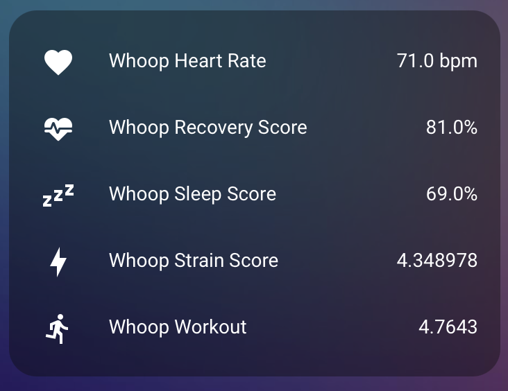
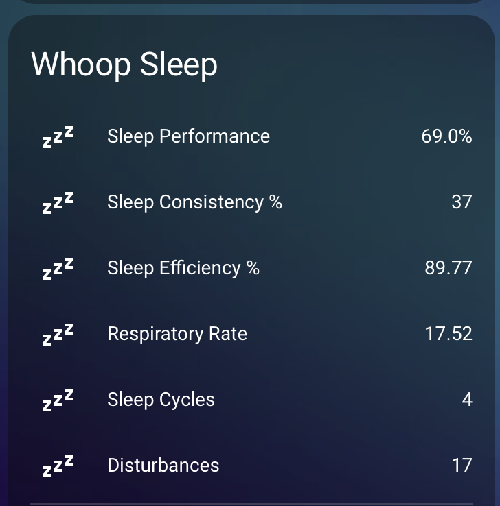
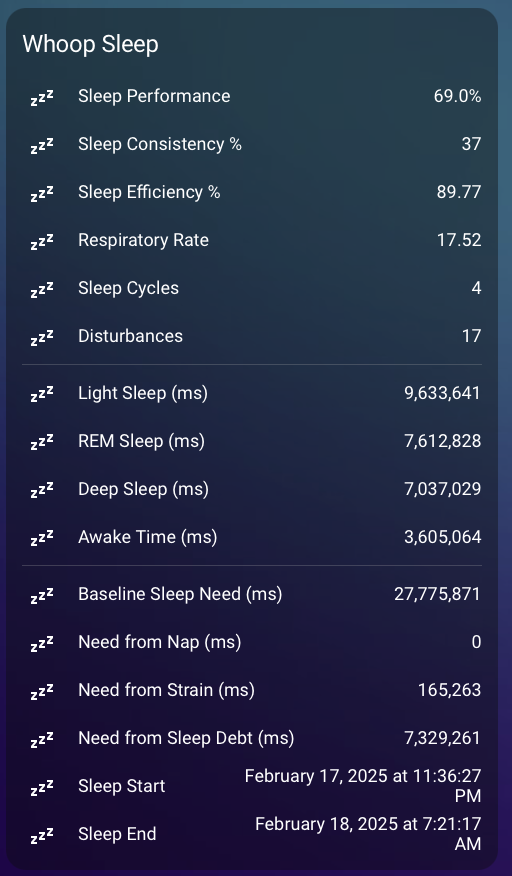
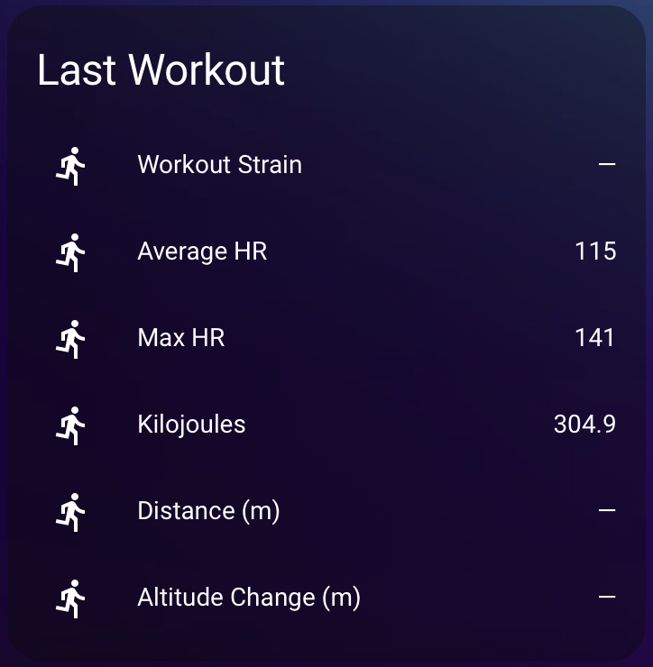
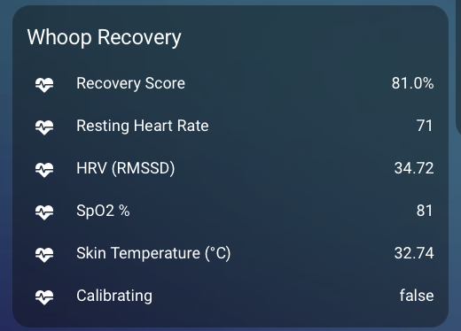
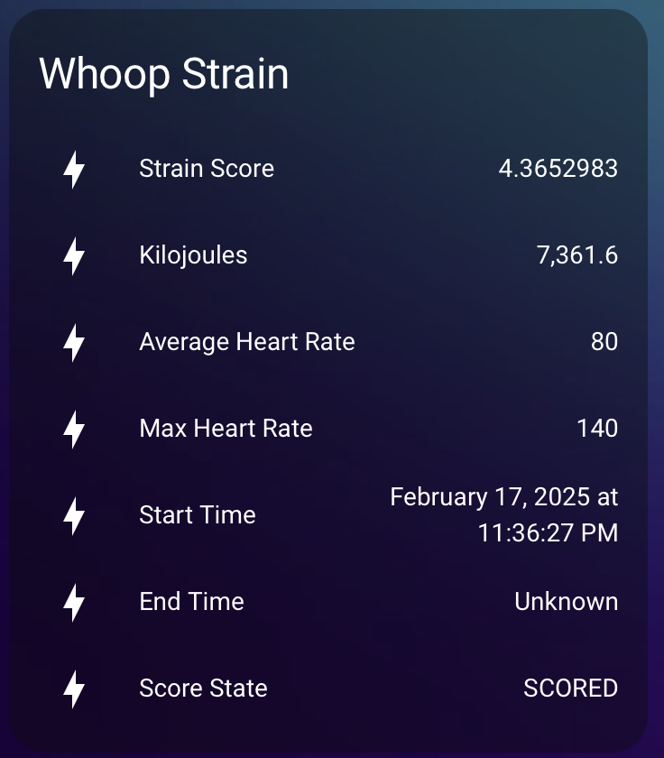

## Visualization Examples

### Simple View

*Basic display of Whoop metrics in Home Assistant*

### Detailed View

*Comprehensive dashboard showing all available Whoop data*

### Sleep View

*Sleep dashboard showing sleep metrics*

### Workout View

*Workout dashboard showing workout metrics*

### Recovery View

*Recovery dashboard showing recovery metrics*

### Strain View

*Strain dashboard showing strain metrics*

### Heart Rate View

*Heart rate dashboard showing heart rate metrics*

## Dashboard Configuration

You can create a custom dashboard using the following YAML configuration. Create a new dashboard in Home Assistant and copy this configuration to get started:

# Whoop Integration for Home Assistant

This project provides a complete integration between Whoop and Home Assistant, consisting of two parts:
1. A backend API service that handles Whoop OAuth authentication and data collection
2. A Home Assistant custom component that displays your Whoop data

## Features

- Real-time Whoop data in Home Assistant
- Automatic data refresh every 5 minutes
- Multiple sensors including:
  - Recovery Score
  - Sleep Score
  - Strain Score
  - Heart Rate
- Detailed attributes for each sensor
- Secure API communication
- Easy setup process

## Prerequisites

- Docker and Docker Compose
- Home Assistant installation
- Whoop Developer Account (for API credentials)
- A domain name and DNS management (for OAuth callback)
- Reverse proxy setup (for HTTPS and port forwarding)

## Domain and Reverse Proxy Setup

This integration requires a publicly accessible domain for OAuth callbacks. You have several options:

1. **Recommended Setup** (What I use):
   - Domain with Cloudflare DNS
   - NGINX Proxy Manager (NPM) for reverse proxy. (I used jc21/nginx-proxy-manager:latest)
   - Set up NPM to forward requests to your Whoop backend service (port 2008)

2. **Alternative Options**:
   - Use a service like Vercel for domain hosting
   - Set up your own reverse proxy (NGINX, Apache, etc.)
   - Use a dynamic DNS service

## Whoop Developer Account Setup

1. Create a Whoop developer account at https://developer.whoop.com
2. Create a new application with the following details:
   - **Application Name**: Your choice (e.g., "Home Assistant Integration")
   - **Login Page URL**: `https://your-domain.com/login`
   - **Webhook URL**: `https://your-domain.com/webhook`
   - **Privacy Policy URL**: Required - you can use your own or a generic one
   - **OAuth Redirect URIs**: `https://your-domain.com/login`
   
3. After creating the application, you'll receive:
   - **Client ID**
   - **Client Secret**

   Save these credentials as they'll be needed during setup.

## Installation

1. Setup your domain in Cloudflare.

- Point your domain's A record to your server's IP address
   - If using Cloudflare:
     - Set SSL/TLS encryption mode to "Full"
     - Create an A record pointing to your server's IP
     - Enable proxy status (orange cloud)

2. Set up reverse proxy in NPM
   - If using NGINX Proxy Manager:
     - Access NPM dashboard (usually at http://your-server-ip:81)
     - Add a new proxy host:
       - Domain: your-domain.com
       - Forward to: http://localhost:2008
       - Enable SSL (Let's Encrypt)

3. Clone this repository:

bash
git clone https://github.com/blaxkxanax/whoop-ha
cd whoop-ha

4. Run the setup script:

bash
chmod +x setup.sh
./setup.sh

The setup script will:
- Create necessary directories
- Set up the backend API service
- Install the Home Assistant custom component
- Guide you through the configuration process

5. Configure your Whoop API credentials:
   - Create a Whoop developer account at https://developer.whoop.com
   - Create a new application
   - Note down your Client ID and Client Secret

## Configuration

### Backend API Service

The backend service requires the following environment variables in `config/.env`:

WHOOP_CLIENT_ID=your_client_id_here
WHOOP_CLIENT_SECRET=your_client_secret_here
WHOOP_API_URL=your_api_url_here
FLASK_SECRET_KEY=generate_a_secure_random_key_here
API_TOKEN=your_static_api_token_here

### Loggin In

After successful setup, you can log in to the backend service at `https://your-domain.com/auth`

If successful, you will be redirect to the Whoop OAuth page. Once done check the docker container logs for your user ID.

### Home Assistant Component

After installation, add the integration through the Home Assistant UI:
1. The custom component is should be copied automatically to your `custom_components` folder.
2. In Home Assistant go to Configuration -> Integrations
3. Click "+ ADD INTEGRATION"
4. Search for "Whoop"
5. Enter your Whoop user ID

### Installation Steps for Dashboard
1. Go to Home Assistant Dashboard
2. Click the three dots menu in the top right
3. Click "Edit Dashboard"
4. Click the "+" button to add a new card
5. Choose "Manual" card
6. Copy and paste the YAML configuration from all_data.yaml
7. Click "Save"
8. Adjust the dashboard to your liking.

## Available Sensors

### Recovery Score
- Main value: Recovery percentage
- Attributes:
  - Resting Heart Rate
  - Respiratory Rate
  - SpO2 Percentage
  - HRV (RMSSD)
  - Skin Temperature (°C)
  - User Calibrating Status
  - Updated At
  - Created At
  - Cycle ID
  - Sleep ID

### Sleep Score
- Main value: Sleep performance percentage
- Attributes:
  - Respiratory Rate
  - Sleep Consistency (%)
  - Sleep Efficiency (%)
  - Sleep Cycles
  - Disturbances
  - Sleep Times:
    - Total Sleep Time (ms)
    - Light Sleep Time (ms)
    - REM Sleep Time (ms)
    - Deep Sleep Time (ms)
    - Awake Time (ms)
  - Sleep Need:
    - Baseline Sleep Need (ms)
    - Need from Nap (ms)
    - Need from Strain (ms)
    - Need from Sleep Debt (ms)
  - Start Time
  - End Time

### Strain Score
- Main value: Day strain
- Attributes:
  - Kilojoules
  - Average Heart Rate
  - Max Heart Rate
  - Start Time
  - End Time
  - Cycle ID
  - Timezone Offset
  - Score State

### Heart Rate
- Main value: Current resting heart rate (bpm)
- Attributes:
  - Max Heart Rate
  - Average Heart Rate

### Workout
- Main value: Workout strain
- Attributes:
  - Altitude Change (meters)
  - Altitude Gain (meters)
  - Average Heart Rate
  - Distance (meters)
  - Kilojoules
  - Max Heart Rate
  - Percent Recorded
  - Heart Rate Zones Duration (milliseconds):
    - Zone 0
    - Zone 1
    - Zone 2
    - Zone 3
    - Zone 4
    - Zone 5
  - Start Time
  - End Time
  - Sport ID
  - Workout ID

## Troubleshooting

### Backend Service
- Check the logs in `data/whoop.log`
- Your data is saved in `data/whoop.db`
- Ensure all environment variables are set correctly

### Home Assistant Component
- Check Home Assistant logs for any error messages
- Verify the API URL and token are correct
- Ensure the backend service is accessible from Home Assistant

## Contributing

Contributions are welcome! Please feel free to submit a Pull Request.

## License

Free to use as you please. No warranties.

## Acknowledgments

- Thanks to the Whoop API team for providing the developer platform
- Thanks to Claude Sonnet for writing the full code. (Yes, I didn't do much)